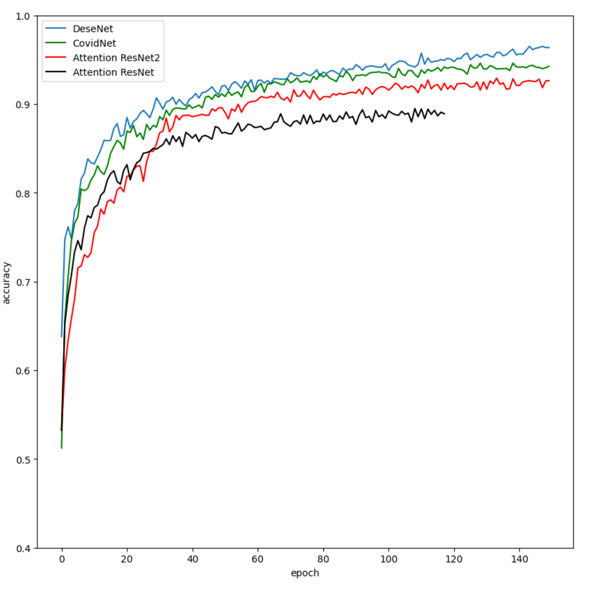
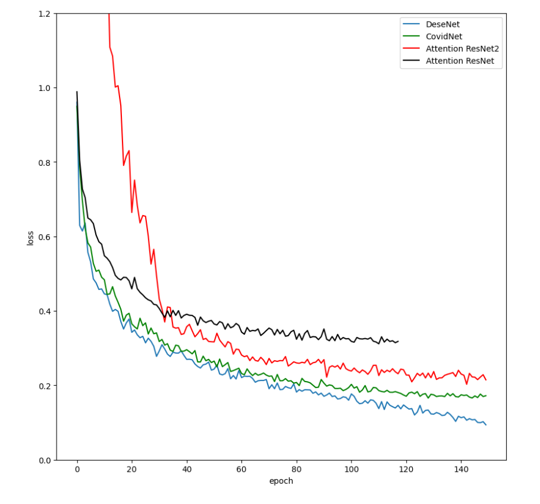
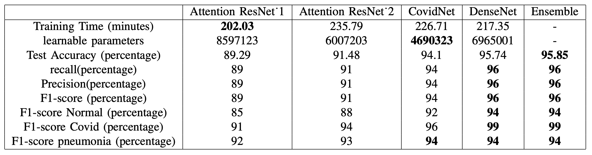
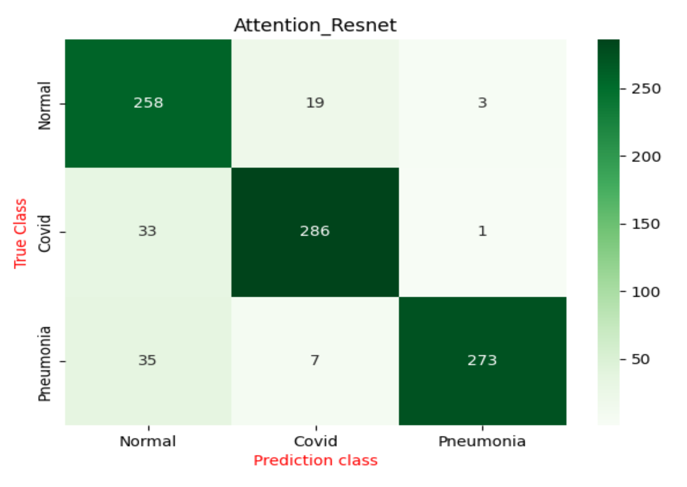
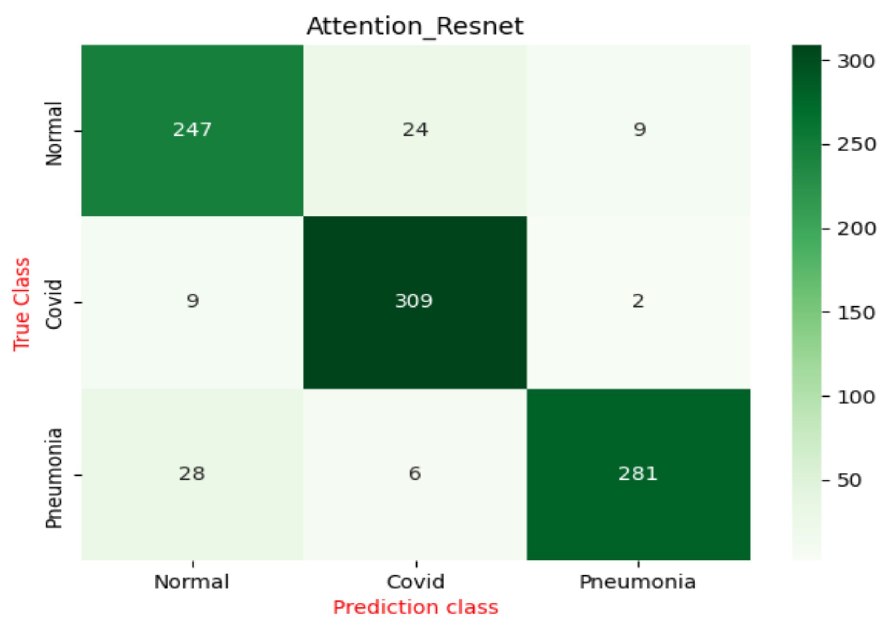
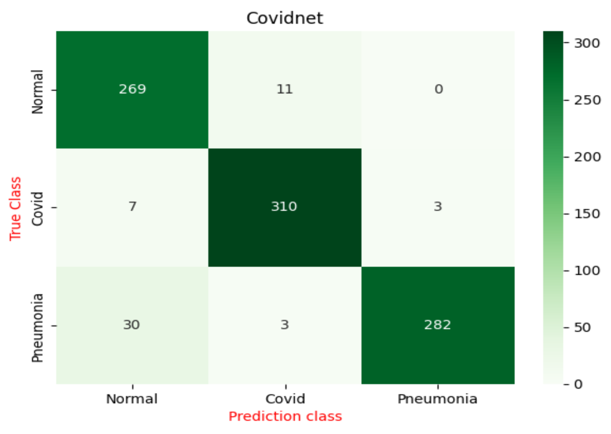
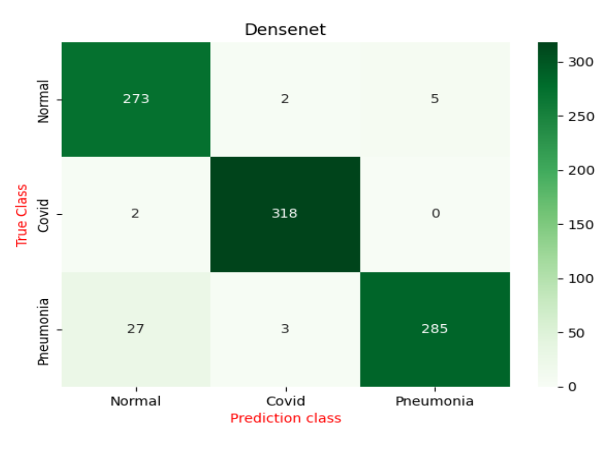
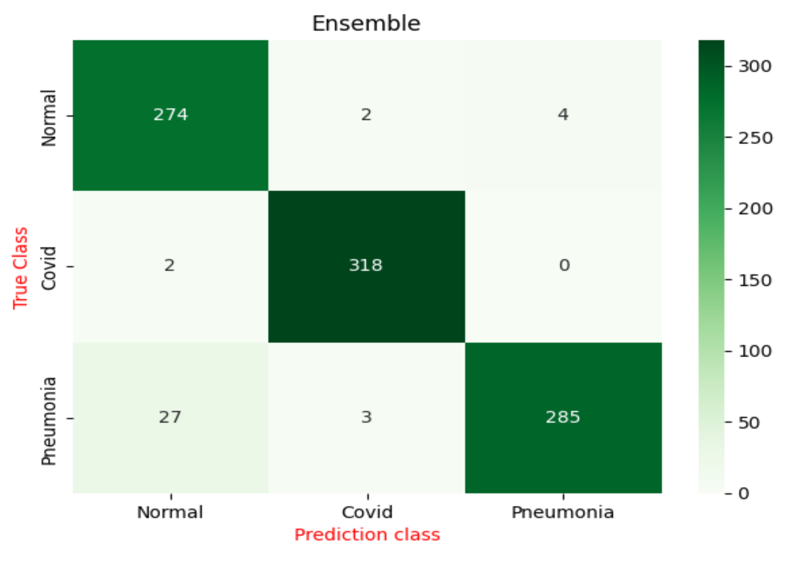

# Ensemble Learning for Chest X-Ray Classification

## Overview

This project investigates the application of deep learning methods for automated chest X-ray classification. Three convolutional neural network architectures—DenseNet-121, CovidNet CXR-2, and Attention ResNet—were implemented and trained from scratch to classify chest X-ray images into three diagnostic categories:

* Normal
* COVID-19
* Pneumonia

To leverage the complementary strengths of individual models, a weighted ensemble strategy was developed and evaluated.

The project was completed as part of the Master's Degree in Physics of Data at the University of Padova.

---

## Research Highlights

* Implemented and trained all models from scratch
* Compared three fundamentally different CNN architectures
* Evaluated ensemble learning for medical image classification
* Achieved **95.85% test accuracy**
* Performed comparative analysis of model strengths and weaknesses
* Investigated classification errors across disease categories
* Analyzed the effectiveness of ensemble learning in medical imaging applications

---

## Dataset

This study uses the **COVID-19, Pneumonia and Normal Chest X-ray PA Dataset** from Mendeley Data.

Dataset:

https://data.mendeley.com/datasets/jctsfj2sfn/1

### Dataset Statistics

| Class     | Images |
| --------- | ------ |
| COVID-19  | 1525   |
| Pneumonia | 1525   |
| Normal    | 1525   |
| Total     | 4575   |

### Data Split

| Dataset    | Samples |
| ---------- | ------- |
| Training   | 2928    |
| Validation | 732     |
| Test       | 915     |

### Preprocessing

All images were:

* Resized to 224 × 224 pixels
* Normalized using dataset statistics
* One-hot encoded

Data augmentation techniques included:

* Random rotation
* Width shift
* Height shift
* Zoom augmentation
* Horizontal flipping
* Brightness variation

---

## Methods

### DenseNet-121

DenseNet introduces dense connectivity between layers, enabling feature reuse and improved gradient propagation. The architecture achieved the highest standalone performance among all evaluated models.

### CovidNet CXR-2

CovidNet is a lightweight architecture specifically designed for COVID-19 detection from chest X-ray images. It employs Projection-Replication-Projection-Expansion (PRPE) blocks to balance computational efficiency and representational capacity.

### Attention ResNet

Attention ResNet incorporates attention modules that guide feature extraction by emphasizing informative image regions during training.

Two Attention ResNet variants were evaluated and compared.

### Weighted Ensemble

Predictions from the best-performing models were combined using a weighted ensemble strategy based on validation accuracy.

The objective was to leverage complementary strengths of individual architectures while reducing model-specific weaknesses.

---

## Results

### Model Comparison

| Model              | Test Accuracy |
| ------------------ | ------------- |
| Attention ResNet 1 | 89.29%        |
| Attention ResNet 2 | 91.48%        |
| CovidNet           | 94.10%        |
| DenseNet-121       | 95.74%        |
| Weighted Ensemble  | **95.85%**    |

### Additional Metrics

| Model        | Precision | Recall | F1 Score |
| ------------ | --------- | ------ | -------- |
| DenseNet-121 | 96%       | 96%    | 96%      |
| Ensemble     | 96%       | 96%    | 96%      |

### Training Accuracy



### Training Loss



### Model Comparison Figure



### Confusion Matrices

#### Attention ResNet 1



#### Attention ResNet 2



#### CovidNet



#### DenseNet



#### Weighted Ensemble



---

## Key Findings

### DenseNet was the strongest individual model

DenseNet achieved the highest standalone performance while maintaining a reasonable balance between computational complexity and predictive performance.

### Ensemble learning produced only a modest improvement

The weighted ensemble improved accuracy from 95.74% to 95.85%.

This suggests that despite architectural differences, the models learned similar decision boundaries and shared several failure modes.

### Pneumonia remained the most challenging class

All architectures exhibited difficulties distinguishing pneumonia from normal chest X-rays, indicating that improved data quality, larger datasets, or additional diagnostic information may be required.

---

## Project Report

The complete technical report describing the architectures, training procedures, experimental setup, and evaluation methodology can be found here:

📄 [Project Report](report/Ensemble_model_of_CARD.pdf)

---

## Repository Structure

```text
.
├── denseNet/
├── covidNet/
├── attention_ResNet_1/
├── attention_ResNet_2/
├── W-ensemble/
├── Demo/
├── figures/
├── report/
├── requirements.txt
├── .gitignore
├── LICENSE
└── README.md
```

### denseNet/

Implementation of DenseNet-121 architecture and related training notebooks.

### covidNet/

Implementation of CovidNet CXR-2 and associated training pipeline.

### attention_ResNet_1/

First implementation of the Residual Attention Network.

### attention_ResNet_2/

Modified Attention ResNet architecture with improved performance.

### W-ensemble/

Weighted ensemble framework combining predictions from multiple architectures.

### Demo/

Example notebooks demonstrating model inference and prediction.

### figures/

Training curves, confusion matrices, and result visualizations.

### report/

Technical project report and supporting documentation.

---

## Installation

Clone the repository:

```bash
git clone https://github.com/Rajaeereza/Lung-disease-prediction-from-X-ray-images.git
cd Lung-disease-prediction-from-X-ray-images
```

Install dependencies:

```bash
pip install -r requirements.txt
```

---

## Reproducing the Experiments

1. Download the dataset from Mendeley Data.
2. Organize the dataset according to the expected directory structure.
3. Train the individual architectures:

   * DenseNet
   * CovidNet
   * Attention ResNet
4. Generate predictions on the test set.
5. Run the weighted ensemble pipeline.
6. Evaluate performance using the provided metrics and confusion matrices.

---

## Lessons Learned

While the primary objective of this project was classification performance, the experiments highlighted the importance of understanding model failure modes rather than focusing exclusively on overall accuracy.

The observation that different architectures produced similar classification errors motivated later interests in model robustness, representation learning, uncertainty estimation, and trustworthy AI for biomedical applications.

---

## Future Directions

Potential extensions include:

* Grad-CAM visualizations
* Uncertainty estimation
* Calibration analysis
* Out-of-distribution detection
* Explainability comparison across architectures
* Robustness evaluation under dataset shift
* Validation on larger and more diverse clinical datasets

---

## References

* Huang et al., DenseNet: Densely Connected Convolutional Networks (CVPR 2017)
* Pavlova et al., COVID-Net CXR-2 (Frontiers in Medicine, 2022)
* Wang et al., Residual Attention Network for Image Classification (2017)

---

## Authors

**Reza Rajaee**
University of Padova

**Sarvenaz Babakhani**
University of Padova
